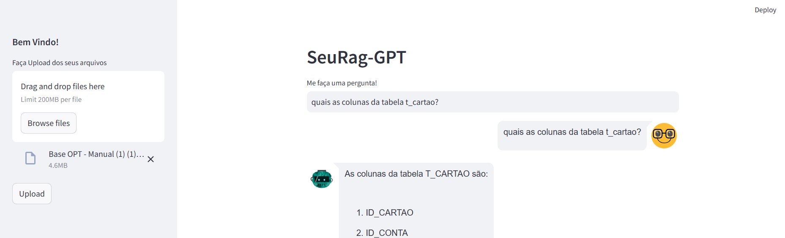

# RAG Upload Chatbot

Este é um projeto de portfólio que demonstra a integração de uma interface Streamlit com um banco de dados vetorial FAISS e um modelo de linguagem grande (LLM) baseado no ChatGPT. O objetivo do projeto é permitir a adição de documentos ou livros, que são transformados e armazenados no banco de dados vetorial, e posteriormente, recuperar essas informações utilizando Recuperação de Informação Guiada (RAG) para interagir com o LLM via Streamlit.



## Funcionalidades

- **Upload de Documentos**: Adicione documentos ou livros através da interface Streamlit.
- **Armazenamento Vetorial**: Os documentos são transformados e armazenados no banco de dados vetorial FAISS.
- **Recuperação de Informação**: Utilize RAG para recuperar informações dos documentos armazenados.
- **Interação com LLM**: Interaja com o modelo ChatGPT via Streamlit, utilizando as informações recuperadas.

## Tecnologias Utilizadas

- **Streamlit**: Para a criação da interface web.
- **FAISS**: Para o armazenamento e recuperação vetorial dos documentos.
- **ChatGPT**: Modelo de linguagem grande utilizado para interação e resposta.
- **LangChain**: Transformar os dados dos documentos em vector e conectar a recuperação dos dados (RAG) com o LLM.

## Como Executar

1. Clone o repositório:
    ```bash
    git clone https://github.com/seu-usuario/rag-upload-chatbot.git
    ```
2. Navegue até o diretório do projeto:
    ```bash
    cd rag-upload-chatbot
    ```
3. Instale as dependências:
    ```bash
    pip install -r requirements.txt
    ```
4. Execute a aplicação:
    ```bash
    streamlit run app.py
    ```

## Contribuição

Contribuições são bem-vindas! Sinta-se à vontade para abrir issues e pull requests.

## Licença

Este projeto está licenciado sob a Licença MIT. Veja o arquivo [LICENSE](LICENSE) para mais detalhes.

## Contato

Para mais informações, entre em contato através do [EMAIL](mailto:danilofelipeneto@gmail.com).
